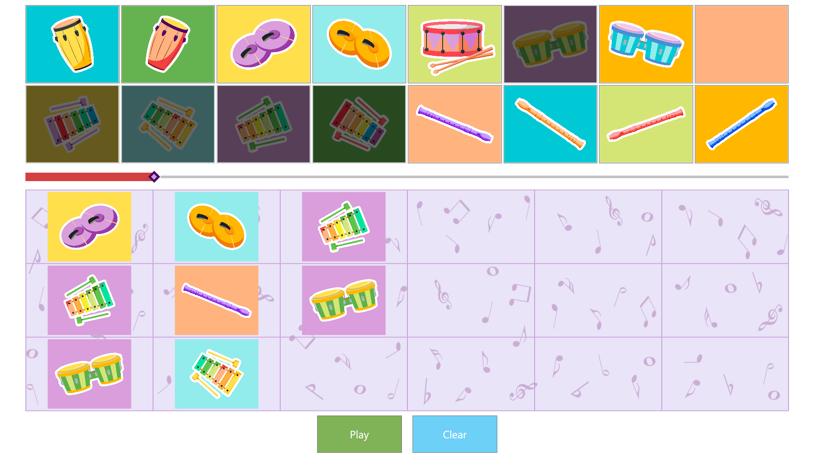

# Techno Audio

Программа, позволяющая составить мелодию на различных музыкальных инструментах. После нажатия на кнопку "Play" загружает данные мелодии по указанному COM порту. Устройство, получившее эти данные должно сыграть полученую мелодию